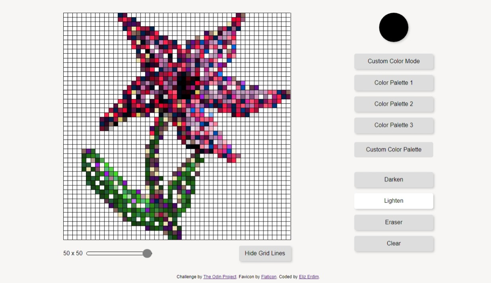

# Etch A Sketch

This is a solution to the [Etch a Sketch project from the Odin Project](https://www.theodinproject.com/lessons/foundations-etch-a-sketch). 

## Table of contents

- [Overview](#overview)
  - [The challenge](#the-challenge)
  - [Screenshot](#screenshot)
  - [Links](#links)
- [My process](#my-process)
  - [Built with](#built-with)
  - [What I learned](#what-i-learned)
  - [Useful resources](#useful-resources)

## Overview

### The challenge

Users should be able to:

- View the optimal layout for the interface depending on their device's screen size
- Draw on the board and use all the additional features

### Screenshot



### Links

- [View Code](https://github.com/elizerdim/etch-a-sketch)
- [Live Preview](https://elizerdim.github.io/etch-a-sketch/)

## My process

### Built with

- HTML
- CSS
- JavaScript

### What I learned

- I know this is a beginner project, but I'm really proud of this one! I feel I went above and beyond to include additional features and spent a lot of time to get it to my liking. I learned a lot about DOM manipulation and color theory!

- CSS ```all``` property - can be used to reset all properties of an element

- I don't usually like using "hacky" wrappers, but [this article](https://css-tricks.com/color-inputs-a-deep-dive-into-cross-browser-differences/) shows just how complicated and near impossible it is to style color type inputs, so I opted to use a div wrapper around it to make it a circle with ```overflow: hidden``` instead of playing around with things like ```-webkit-appearance```, ```-webkit-color-swatch```, ```-webkit-color-swatch-wrapper```, and ```-moz-color-swatch``` and still not getting it right across browsers.

- How to style sliders (range inputs) with consistency across all browsers. There is a very handy style generator for range inputs liked below in the Useful Resources section.

- What HEAD means in git, what the caret(s) that come after it mean, ```git reset```, ```git reset HEAD^```, ```git reset HEAD^^```. Also ```git commit --fixup=b1d7848``` https://stackoverflow.com/a/27721031

- ```e.target.tagName``` to access the element type.

- Event listeners should be nested to achieve the functionality of drawing only when mouse is clicked and kept pressed while moving the cursor and stop drawing when it is released.

```js
boardSquares.forEach(square => square.addEventListener('mousedown', startDrawing));

function startDrawing(e) {
  boardSquares.forEach(square => square.addEventListener('mouseenter', draw));
  window.addEventListener('mouseup', () => {
    boardSquares.forEach(square => square.removeEventListener('mouseenter', draw))
  })
}

function draw(e) {
  ...
}
```

- Sometimes, the browser confuses this activity with drag and drop, so preventing the default behavior of these events is helpful.

```js
document.body.addEventListener('dragstart', event => {
  event.preventDefault();
});

document.body.addEventListener('drop', event => {
  event.preventDefault();
});
```

- D3.js - I had completed Data Visualization lessons on freeCodeCamp earlier, but this is the first time I'm using it in a project. Figuring out how to do darkening and lightening effects took a lot of my time, I fell into a rabbit hole of color theory and complicated math equations to convert rgb colors into hsl before I ultimately decided to use d3.js instead. I added ```<script src="https://d3js.org/d3.v7.min.js"></script>``` in the head of the html file to use it.

### Useful resources

- [CSS ```all``` property](https://developer.mozilla.org/en-US/docs/Web/CSS/all) - Has browser compatibity across all major browsers
- [range input style CSS generator](https://range-input-css.netlify.app/) - This CSS generator is very handy in styling range inputs with consistency across all browsers.
- [removeEventListener](https://www.reddit.com/r/learnjavascript/comments/101i2ca/comment/j2nq9sx/?utm_source=share&utm_medium=web3x&utm_name=web3xcss&utm_term=1&utm_content=share_button)
- [disabling drag and drop events](https://bobbyhadz.com/blog/disable-drag-and-drop-in-javascript#disabling-drag-and-drop-for-all-elements-in-the-document)